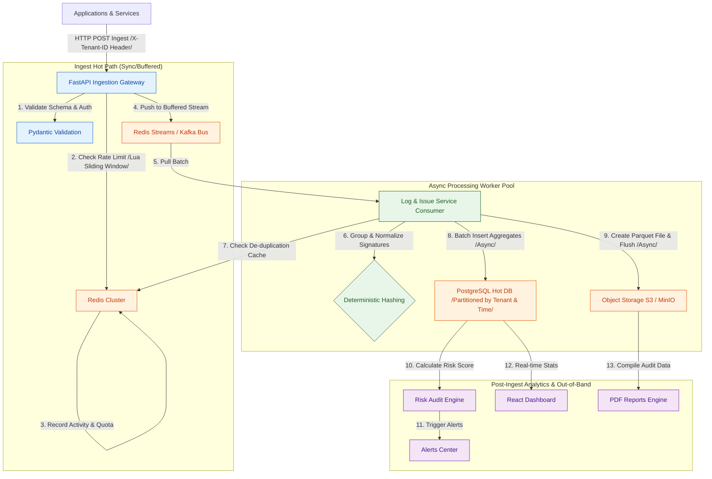

```mermaid
flowchart TD
    A[Applications & Services] -->|HTTP POST Ingest /X-Tenant-ID Header/| B[FastAPI Ingestion Gateway]
    
    subgraph "Ingest Hot Path (Sync/Buffered)"
        B -->|1. Validate Schema & Auth| B1[Pydantic Validation]
        B -->|2. Check Rate Limit /Lua Sliding Window/| C[Redis Cluster]
        C -->|3. Record Activity & Quota| C
        B -->|4. Push to Buffered Stream| D[Redis Streams / Kafka Bus]
    end

    subgraph "Async Processing Worker Pool"
        D -->|5. Pull Batch| E[Log & Issue Service Consumer]
        E -->|6. Group & Normalize Signatures| E1{Deterministic Hashing}
        E -->|7. Check De-duplication Cache| C
        E -->|8. Batch Insert Aggregates /Async/| F[PostgreSQL Hot DB /Partitioned by Tenant & Time/]
        E -->|9. Create Parquet File & Flush /Async/| G[Object Storage S3 / MinIO]
    end

    subgraph "Post-Ingest Analytics & Out-of-Band"
        F -->|10. Calculate Risk Score| H[Risk Audit Engine]
        H -->|11. Trigger Alerts| I[Alerts Center]
        F -->|12. Real-time Stats| J[React Dashboard]
        G -->|13. Compile Audit Data| K[PDF Reports Engine]
    end

    classDef active fill:#e3f2fd,stroke:#1565c0,stroke-width:1px,color:#0d47a1;
    classDef storage fill:#fff3e0,stroke:#e65100,stroke-width:1px,color:#bf360c;
    classDef worker fill:#e8f5e9,stroke:#1b5e20,stroke-width:1px,color:#1b5e20;
    classDef analytics fill:#f3e5f5,stroke:#7b1fa2,stroke-width:1px,color:#4a148c;
    
    class B,B1 active;
    class C,D,F,G storage;
    class E,E1 worker;
    class H,I,J,K analytics;
```